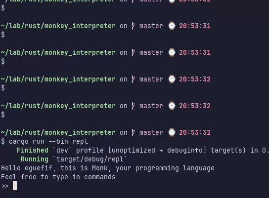
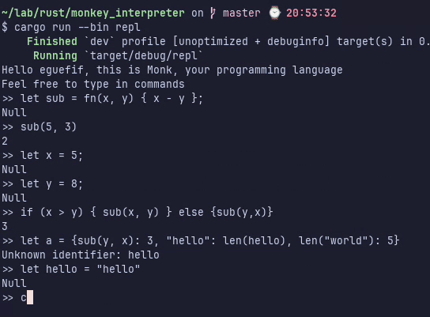

# Monkey Interpreter

## Description

This projet follows the book *Writing an Interpreter in Go*. It is written in Rust.

## Getting Started

### Dependencies

* [Rust](https://www.rust-lang.org/tools/install)

### Installing

* Clone the repo

### Executing program

```bash
cargo run --bin repl
```

```
>> let x = 5 + 5;
Null
>> x;
10
```

## Animated gif



## Acknowledgments

Inspiration, code snippets, etc.
* [Writing an Interpreter in Go](https://interpreterbook.com/)
